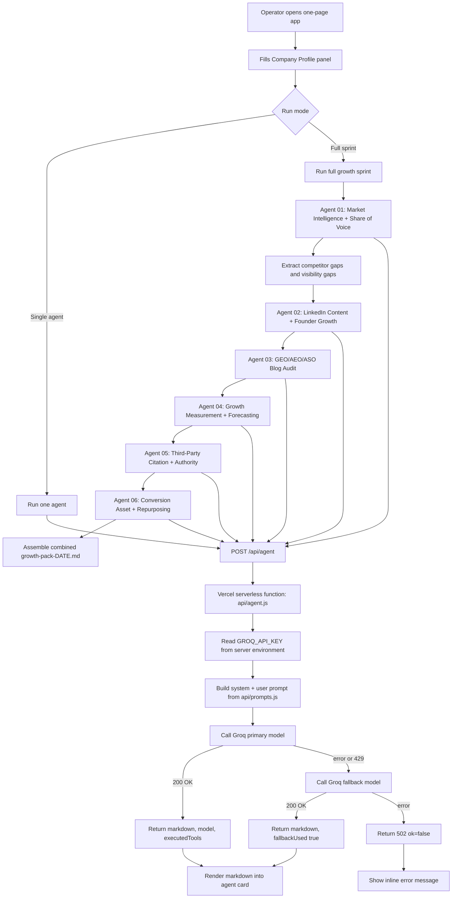

# AGENT_FLOWS.md — Updated Architecture, Prompts, and Orchestration

This file updates the original four-agent prototype to match the newer `voicecare_safe_ai_growth_engine(2)` playbook. It adds the existing-blog GEO/AEO/ASO audit workflow, share-of-voice scorecards, founder growth loops, third-party citation work, conversion assets, and repurposing outputs while preserving the strict safe-only LinkedIn posture.

## 1. Updated Architecture Overview



The browser still never talks to Groq directly. All model calls go through `/api/agent`, and the API key remains server-side only.

---

## 2. Updated Model Selection

| Agent | Primary model | Fallback model | Temp | Max tokens | Reasoning |
|---|---|---:|---:|---:|---|
| Market Intelligence + Share of Voice | `groq/compound` | `llama-3.3-70b-versatile` | 0.4 | 2200 | Needs public web grounding for competitors, category visibility, and citation opportunities. |
| LinkedIn Content + Founder Growth | `llama-3.3-70b-versatile` | `llama-3.1-8b-instant` | 0.7 | 2400 | Drafting-heavy. Needs high-quality natural writing and multiple variants. |
| GEO/AEO/ASO Blog Audit | `groq/compound` | `llama-3.3-70b-versatile` | 0.4 | 2600 | Needs website/page analysis and current AI-search awareness. |
| Growth Measurement + Forecasting | `llama-3.3-70b-versatile` | `llama-3.1-8b-instant` | 0.3 | 1900 | Needs arithmetic discipline and grounded reporting. |
| Third-Party Citation + Authority | `groq/compound` | `llama-3.3-70b-versatile` | 0.4 | 2200 | Needs current public web discovery. |
| Conversion Asset + Repurposing | `llama-3.3-70b-versatile` | `llama-3.1-8b-instant` | 0.6 | 2400 | Planning/drafting work that does not require live search unless external references are requested. |

---

## 3. Updated Request / Response Contract

```json
POST /api/agent
Content-Type: application/json

{
  "agentType": "market-intel" | "linkedin-content" | "geo-visibility" | "growth-report" | "citation-authority" | "conversion-repurposing",
  "companyProfile": {
    "companyName": "string required",
    "website": "string",
    "icp": "string",
    "persona": "string",
    "tone": "string",
    "competitors": "string comma-separated",
    "currentFollowers": 2900,
    "followerGoal": 10000,
    "daysRemaining": 90
  },
  "agentInputs": {
    "extraContext": "string optional",
    "topic": "string optional",
    "proofPoints": "string optional",
    "query": "string optional",
    "blogUrls": "string optional newline-separated URLs",
    "weeklyMetrics": "string optional",
    "aiVisibilityNotes": "string optional",
    "assetType": "string optional",
    "sourceAsset": "string optional"
  }
}
```

Success remains:

```json
{
  "ok": true,
  "markdown": "## Section heading\n...",
  "model": "groq/compound",
  "fallbackUsed": false,
  "executedTools": [],
  "note": "only present when fallback lost live web-search capability"
}
```

Failure remains:

```json
{ "ok": false, "error": "human-readable message" }
```

---

## 4. Updated Shared Safety Core

Every system prompt must continue to interpolate this shared block:

```text
Hard rules you must always follow, with no exceptions:
1. You only research, analyze, draft, and report. You never publish, post, comment, like, follow, connect, message, or take any other action on LinkedIn or any other platform. You have no ability to do so and must never imply otherwise.
2. You only use public information, first-party analytics manually supplied by the operator, or information explicitly provided in the user message. You never reference, simulate, or imply access to scraped LinkedIn data, Sales Navigator, or any logged-in social platform view.
3. You never invent facts, metrics, customer names, investor names, funding figures, compliance claims, or statistics. If something is not explicitly provided and not confidently verifiable from public sources, say so plainly.
4. You never recommend or describe automated social media activity: no auto-connect, auto-DM, auto-comment, auto-like, auto-follow, scraping, bots, proxies, engagement pods, fake accounts, or browser automation.
5. You never process, request, store, or reference patient data or protected health information (PHI). You only work with public company, marketing, competitive, content, and growth data.
6. You do not make clinical, medical, compliance, security, or ROI claims beyond what is explicitly supplied or publicly verifiable.
7. You always output clean Markdown only — no preambles, no meta commentary, and no unsupported claims.
```

---

## 5. Updated Agent Prompts

### Agent 01 — Market Intelligence + Share-of-Voice Agent

**System behavior:** Research competitors and produce both qualitative market gaps and measurable visibility gaps.

**Required output sections:**

```text
## Competitor Snapshot
Markdown table: Competitor | Category | Positioning | Main Use Cases | Proof Points | Content Themes | VoiceCare Counter-Position

## Competitor Ranking and Share-of-Voice Scorecard
Markdown table: Competitor | LinkedIn Followers | AI-Engine Mentions | Google Category Presence | Third-Party Mentions | Key Strength | VoiceCare Gap | Action

## Top 5 Content & Category Gaps
Numbered list. Each gap must name the competitor weakness or buyer question it responds to.

## 3. Differentiation Angles
Three reusable lines for LinkedIn, website copy, sales conversations, and AI-search content.

## This Week's Category Narrative
40-60 words. Should be repeatable across founder posts, company posts, blog updates, and sales conversations.

## Safe Next Actions
Exactly 5 actions. No LinkedIn automation, no scraping, no auto-DMs.
```

**New input fields:**

```text
extraContext
manualAnalyticsNotes
priorityCompetitors
```

---

### Agent 02 — LinkedIn Content + Founder Growth Agent

**System behavior:** Draft content for company page, founder/leadership profiles, employee advocates, and partner/investor amplification. All output is for manual human editing and publishing only.

**Required output sections:**

```text
## Company Page Post Drafts
Include hook, body, soft CTA, and draft label.

## Founder / Leadership Post Drafts
Prioritize category POV, operational teardown, founder lesson, customer problem education, and report/webinar promotion.

## Employee Advocacy Snippets
Short POV snippets employees can manually personalize. Explicitly warn against copy-pasting identical comments/posts.

## Carousel / Document Post Outline
6-8 slides, bullet points only.

## Manual Comment Suggestions
Short starting points for humans to personalize manually.

## Partner / Investor Amplification Kit
3 repost captions, 1 founder quote, 1 approved company description, and 1 short partner email draft.

## Repurposing Plan
Show how this week's topic can become blog, company posts, founder posts, carousel, newsletter, and sales enablement asset.
```

**Important rule:** Every individual post draft must end with:

```text
DRAFT — human review required before posting.
```

---

### Agent 03 — AI Search / GEO / AEO / ASO Agent

**System behavior:** Improve AI-engine and Google discoverability through existing content audits, rewrite briefs, new content briefs, and answer-engine testing plans.

**Required output sections:**

```text
## Existing Blog / Page Audit
For each URL supplied, output:
Blog URL:
Current target query:
Recommended target query:
Current issue summary:
GEO/AEO/ASO score out of 10:
Recommended new title:
Recommended meta title:
Recommended meta description:
New answer block:
New outline or section changes:
FAQ additions:
Internal links to add:
External references needed:
Schema recommendation:
CTA recommendation:
Risk notes / claims needing human approval:
Priority: High / Medium / Low

## Content Brief for: [Target Query]
Include H1, meta title, meta description, 40-60 word answer-style definition, section outline, FAQ block, internal links, schema.org recommendation, and CTA.

## Answer-Engine Citation Testing Protocol
Table: Query | Engine | VoiceCare Mentioned? | Position | Competitors Mentioned | Sources Cited | Content Type Cited | Why VoiceCare Was Included/Excluded | Action

## Content Gap Summary
2-3 sentences on what evidence, pages, citations, or freshness signals are likely missing.

## Safe Next Actions
Exactly 5 actions limited to on-site content, metadata, schema, internal linking, external citation opportunities, or manual AI-engine testing.
```

**New input fields:**

```text
query
blogUrls
searchConsoleNotes
ga4Notes
manualAiEngineResults
```

---

### Agent 04 — Growth Measurement + Forecasting Agent

**System behavior:** Convert manually exported metrics into pace-to-goal reporting, reverse follower math, source-level forecast, and next experiments.

**Required output sections:**

```text
## Pace-to-Goal
Show arithmetic: target minus current followers, weeks remaining, required weekly net-new average.

## Reverse Follower Growth Model
Table: Source | Weekly Follower Contribution Target | Actual This Week | Gap | Fix for Next Week

## Visibility Scorecard
LinkedIn visibility, founder visibility, Google visibility, AI-engine visibility, citation visibility, directory visibility, earned media, content authority.

## What the Numbers Say
3-5 observations grounded only in supplied metrics.

## Top & Underperforming Themes
Use only supplied metrics. If data is missing, say so.

## Recommended Experiments for Next Week
Exactly 3 safe experiments. No automation, no paid followers/leads, no engagement pods.
```

---

### Agent 05 — Third-Party Citation + Authority Agent

**System behavior:** Identify safe third-party sources where VoiceCare can be mentioned, cited, listed, interviewed, or included in public category pages.

**Required output sections:**

```text
## Citation Opportunity List
Table: Target Source | Type | Domain Authority Signal | Why It Matters | Suggested Pitch | Owner | Status

## Priority Targets
Top 10 targets ranked by likely AI-engine citation value and buyer trust.

## Pitch Angles
5 safe pitch angles tied to healthcare RCM, patient access, payer call automation, prior auth, claims status, eligibility verification, and agentic AI.

## Trust Asset Requirements
Security page, compliance page, responsible AI statement, human escalation explanation, implementation methodology, monitoring/QA process, data privacy FAQ.

## Safe Next Actions
Exactly 5 actions. No fake coordination, no unapproved logos, no automated reposting.
```

---

### Agent 06 — Conversion Asset + Repurposing Agent

**System behavior:** Ensure visibility converts into qualified business conversations by mapping content to CTAs, lead magnets, reports, webinars, comparison pages, and sales enablement.

**Required output sections:**

```text
## Conversion Asset Map
Table: Asset | Purpose | Buyer Stage | CTA | Owner | Priority

## CTA Mapping
Table: Content Type | Recommended CTA | Destination Page | UTM Recommendation

## Repurposing Matrix
Table: Source Asset | Founder Posts | Company Posts | Carousel | Newsletter | Blog/FAQ | Sales Asset

## Original Data / Benchmark Asset Ideas
List safe benchmark/report ideas and evidence rules. No customer data or ROI claim unless approved.

## Safe Next Actions
Exactly 5 actions for manual execution.
```

---

## 6. Updated Full Sprint Orchestration

When the operator clicks **Run full growth sprint**, run agents in this order:

1. **Market Intelligence + Share-of-Voice**.
2. Extract:
   - top 5 content/category gaps,
   - competitor visibility gaps,
   - differentiation angles,
   - weekly category narrative.
3. Pass those into **LinkedIn Content + Founder Growth**.
4. Pass those into **GEO/AEO/ASO Blog Audit**.
5. Pass weekly metrics and follower targets into **Growth Measurement + Forecasting**.
6. Pass competitor/citation gaps into **Third-Party Citation + Authority**.
7. Pass current topic/content asset into **Conversion Asset + Repurposing**.
8. Assemble one combined `growth-pack-DATE.md`.

The combined growth pack should include:

```text
# Safe AI Growth Sprint Pack — YYYY-MM-DD

## 1. Market Intelligence + Share of Voice
## 2. LinkedIn Content + Founder Growth
##  GEO/AEO/ASO Blog Audit + Content Brief
## 4. Growth Measurement + Forecasting
## 5. Third-Party Citation + Authority
## 6. Conversion Asset + Repurposing
## 7. Human Review Checklist
## 8. Compliance Checklist
```

---
